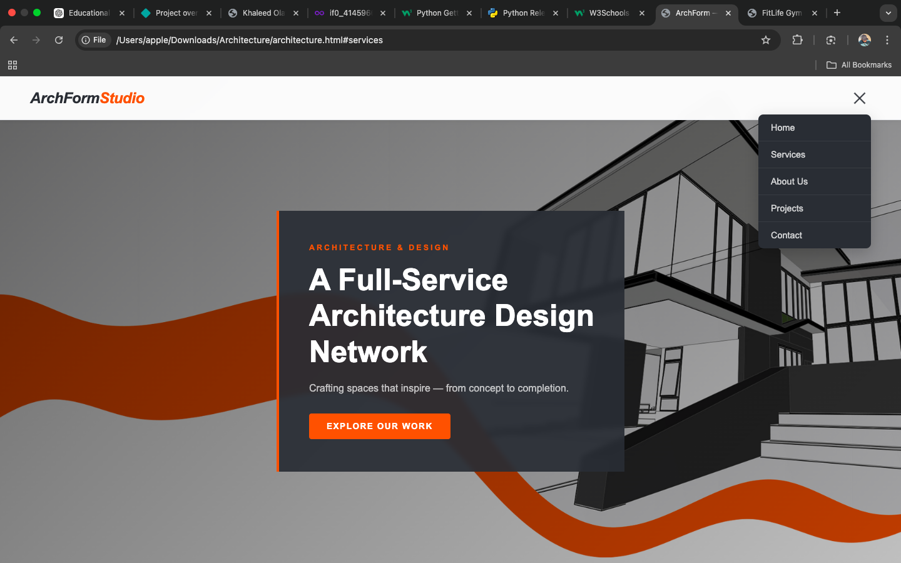
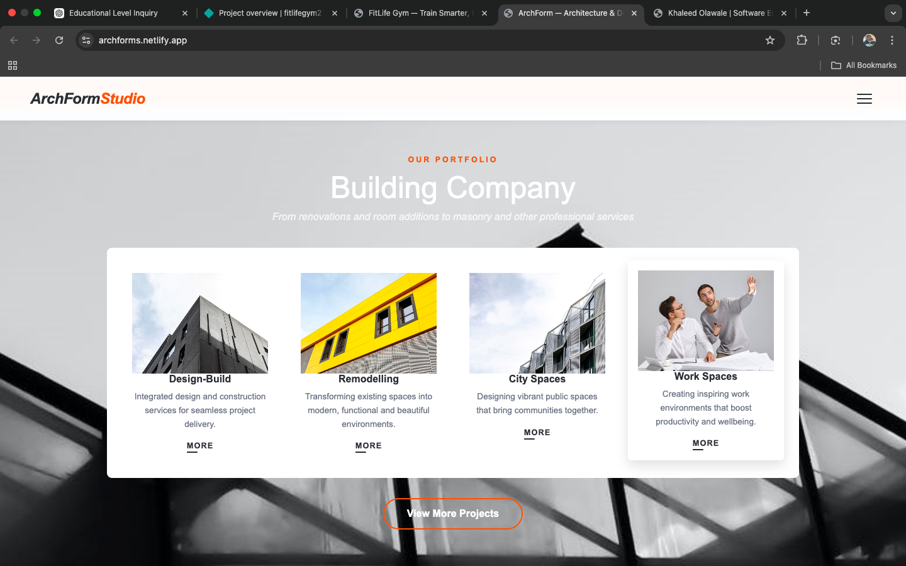

# ArchFormStudios

A modern and responsive architecture website built with HTML and CSS, showcasing our services, company profile, and completed projects with a clean and professional design.

---

## 🚀 Live Demo
https://archforms.netlify.app/

---

## 💻 GitHub Repository
https://github.com/khaleedolawale/architecture

---

## 🛠️ Built With
- HTML
- CSS

---

## 📸 Screenshot

---

## 📌 Features
- Responsive design (mobile-friendly)
- Clean and modern architecture layout
- Services section highlighting offerings
- About Us section introducing the brand
- Projects section showcasing completed works

---

## 🎯 Purpose
This project was created to present an architecture firm's online presence, focusing on visual appeal, structure, and user-friendly navigation.

---

## 📬 Contact
For inquiries or collaborations, feel free to reach out.
